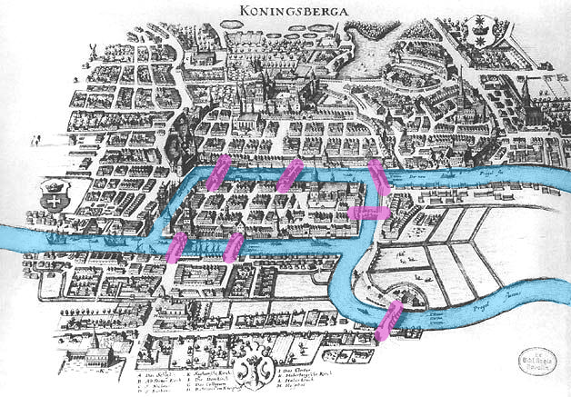
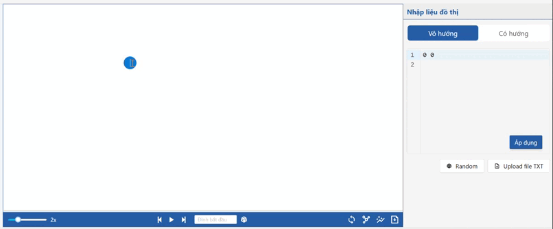
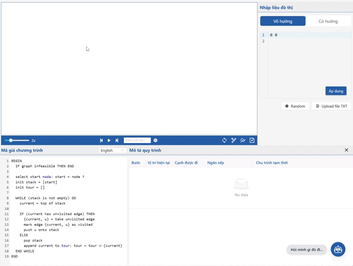
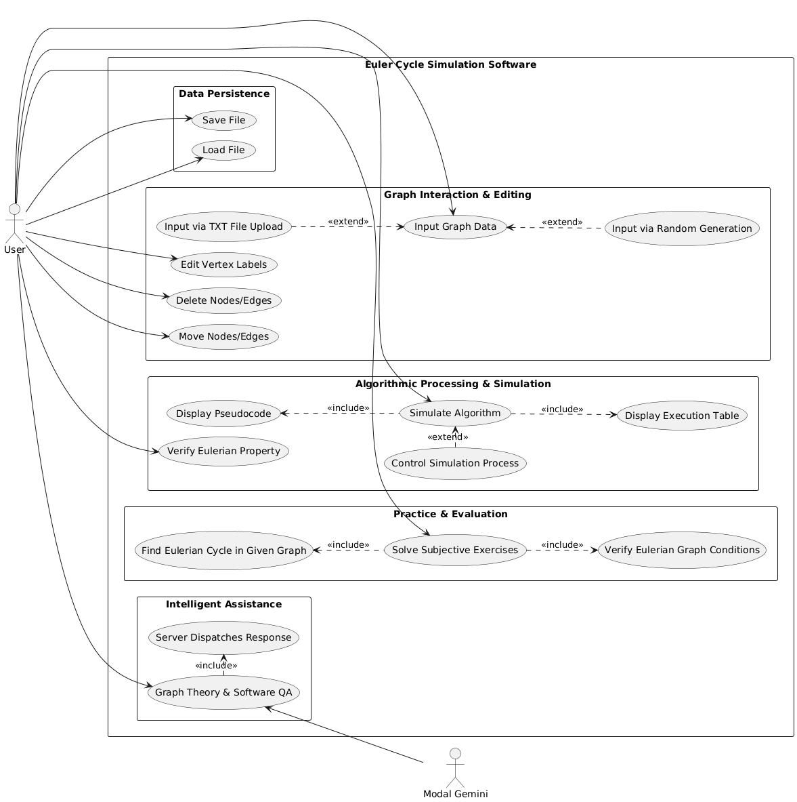

<p>&nbsp;</p>
<p align="center">
  
<p />

<p align="center">
  
  
  
  
</p>

<p align="center">
  
  
  
  
  
  
  
  
  
</p>

<p align="center">⭐ Star me on GitHub — your support motivates me a lot! (´▽`ʃ♡ƪ)</p>

---

## 📜 Table of Contents
* [💫 About ECV](#about)
* [✨ Features](#feature)
  * [📊 Graph Interaction & Editing](#graph-interaction)
  * [🧠 Algorithmic Processing & Simulation](#algorithimic)
  * [✍️ Practice](#practice)
  * [💾 Data Persistence](#data)
  * [🤖 Intelligent Assistance](#ai)
* [🏆 Achievement](#achievement)
* [3. How It Works?](#3-how-it-works)

## <a id="about"></a>💫 About ECV
<p>
  
  
  <strong>Euler Cycle Virtualisation (ECV)</strong> is an interactive platform designed to transform the abstract concepts of graph theory into dynamic visual experiences. The project focuses on step-by-step simulations of the Euler Cycle algorithm — a classic problem originating from the historic "[Seven Bridges of Königsberg](https://en.wikipedia.org/wiki/Seven_Bridges_of_K%C3%B6nigsberg)" puzzle. By automating the validation and traversal processes, ECV effectively bridges the gap between complex mathematical theorems and practical computer science education.
</p>

<p>
  The application overcomes the limitations of traditional static text by providing a responsive graphical environment that updates vertex and edge states in real-time. Users can easily design custom graphs and verify algorithms on complex structures without the risk of manual calculation errors. This makes ECV a powerful tool for studying, teaching, and mastering algorithmic thinking in modern computer science.
</p>

## <a id="feature"></a> ✨ Features

### <a id="graph-interaction"></a> 📊 Graph Interaction & Editing

<p>
  

  <p style="margin-left: 30px;">
    Flexible Graph Input: Support for multiple graph initialization methods, including manual node/edge creation, structured text file uploads (.json), format graph by many color for edges and nodes, and automated random graph generation.

  Dynamic Canvas Manipulations: Real-time graph editing capabilities allowing users to update vertex labels, delete specific nodes/edges, and freely relocate components via drag-and-drop.
  <p />
</p>

<br />

<p>

  ### <a id="algorithimic">🧠 Algorithmic Processing & Simulation</a> 
  
  Eulerian Property Validation: Automated pre-check system to instantly verify whether a given graph contains an Eulerian Cycle based on mathematical theorems (vertex degrees, connectivity).


  Step-by-step Algorithm Simulation: Interactive playback controls (Play, Pause, Next Step) that visually demonstrate the traversal logic in real-time.

  Comprehensive Execution Insight: Dual-view synchronization featuring a dynamic process tracking table alongside a highlighted pseudocode panel to map visual states to algorithmic logic.

</p>

### <a id="practice"></a> ✍️ Practice
Interactive Exercises: A dedicated module for subjective assignments where users can test their understanding of graph theory.

Eulerian Cycle Discovery: Hands-on tasks requiring users to manually verify Eulerian properties and trace the exact Eulerian path/cycle on custom pre-defined graphs.

### <a id="data"></a> 💾 Data Persistence
Graph Serialization: Ability to save custom-designed graphs to local storage and reload existing configuration files seamlessly for continuous work.

<p>

  ### <a id="ai"></a> 🤖 Intelligent Assistance
  **Real-time Contextual QA:** Features an intelligent chatbot powered by Modal Gemini, leveraging In-Context Learning and Context Injection techniques. The system automatically bundles the current graph structure data from the client-side with pre-defined system prompts from the backend to optimize AI responses. This enables the chatbot to provide highly accurate answers, ranging from software user guides and graph theory concepts to real-time analysis of the user's current graph topology.
</p>

## <a id="achievement"></a> 🏆 Achievement

<p>
  

  <br />
  <br />
  <br />

  * **Grade:** Received a perfect score of **10/10** for the Fundamental Software Engineering Project course.
  * **Evaluated by:** Department of Software Engineering, Can Thu University.
</p>

## <a id="usecase"></a> 🗺️ Usecase diagram
<p align="center">

<p/>

## ⚙️ Installation / Hướng dẫn cài đặt

### 1. Clone the repository / Tải dự án

Open your terminal and run the following commands:
Mở terminal và chạy các lệnh sau:

```bash
git init
git clone <url-repo>
cd euler-cycle-project
```

### 2. Install Dependencies / Cài đặt thư viện

You need to install dependencies for both Frontend and Backend folders. Bạn cần cài đặt thư viện cho cả hai thư mục Frontend và Backend.

**Frontend:**

```bash
cd Frontend
npm i
```

**Backend:** (Open a new terminal or navigate back / Mở terminal mới hoặc quay lại thư mục gốc)

```bash
cd ../Backend
npm i
```

## 🔑 Configuration / Cấu hình môi trường (.env)

You need to create a **.env** file in both **Frontend** and **Backend** folders. Bạn cần tạo file **.env** tại cả hai thư mục **Frontend** và **Backend**.

**Frontend (Frontend/.env)**
Copy and paste the following content: Sao chép và dán nội dung sau:

```bash
VITE_SERVER_URL=http://localhost:3001/api/chat
VITE_START_URL=http://localhost:3001/api/start
VITE_FACEBOOK_LINK=<your_facebokk>
VITE_EMAIL=<your_email>
VITE_API_GITHUB_PROFILE=<your_link_github>
```

**Backend (Backend/.env)**
Copy and paste the following content: Sao chép và dán nội dung sau:

```bash
GEMINI_API_KEY=<your_api_key>
```

> **How to get `GEMINI_API_KEY`:**
>
> 1. Visit [Google AI Studio](https://aistudio.google.com/).
> 2. Create a new API Key.
> 3. Paste it into the `GEMINI_API_KEY` field above.
>
> **Cách lấy `GEMINI_API_KEY`:**
>
> 1. Truy cập [Google AI Studio](https://aistudio.google.com/).
> 2. Tạo một API Key mới.
> 3. Dán nó vào dòng `GEMINI_API_KEY` ở trên.

## 🚀 Running the Project / Chạy dự án

### 1. Start Backend

Open the terminal in the **Backend** folder and run:
Mở terminal tại thư mục **Backend** và chạy:

```bash
node ./server.ts
```

### 2. Start Frontend

Open the terminal in the **Frontend** folder and run:
Mở terminal tại thư mục **Frontend** và chạy:

```bash
npm run dev
```

## 🎉 Result / Kết quả

If configured successfully, after about 1-3 minutes, you will see an interface like this:
Nếu cấu hình thành công, sau khoảng 1-3 phút bạn sẽ thấy giao diện như thế này hiện ra:


## 💡 Usage Guide / Hướng dẫn sử dụng

**[English]**
Simply ask the Chatbot inside the software about Euler cycles or how to use the graph. Note: If you don't have an API Key... well, it's not a big deal. You can just figure out how to use it yourself =))

**[Tiếng Việt]**
Đơn giản là hãy hỏi con Chatbot được tích hợp trong phần mềm để biết cách dùng. Lưu ý: Nếu bạn không có API Key thì không sao cả, bạn có thể tự mò cách dùng =))
